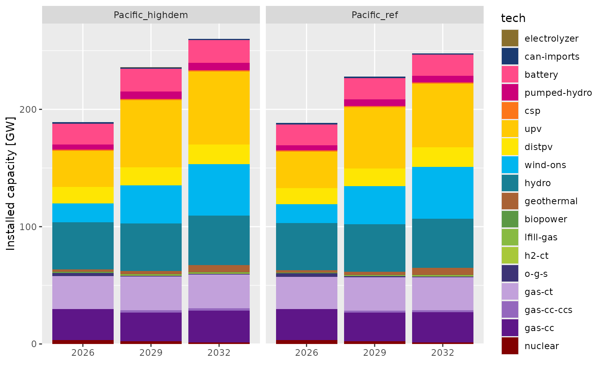
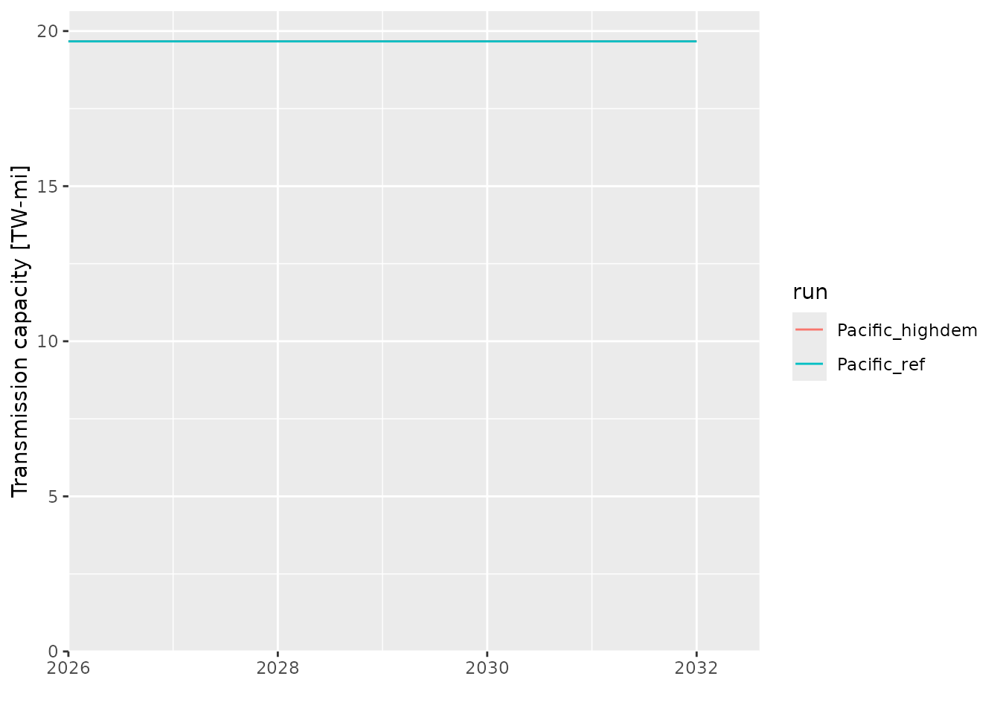
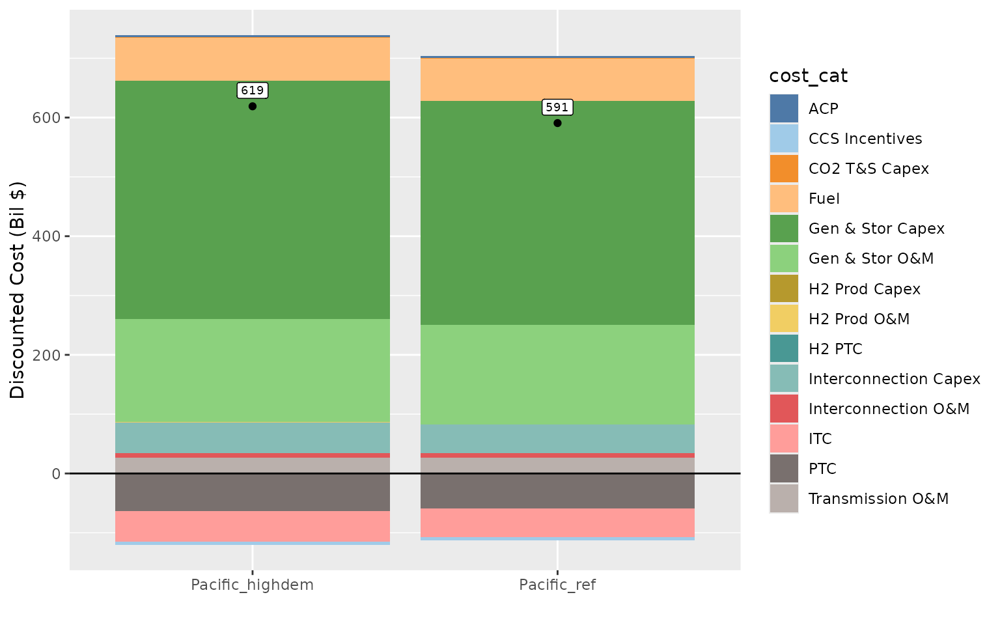

# Getting Started with reedling

This vignette walks through the core reedling workflow: loading ReEDS
run data, formatting technology categories, and creating common plots.

## Setup

``` r

library(reedling)
#> Warning: replacing previous import 'data.table::month' by 'lubridate::month'
#> when loading 'reedling'
library(data.table)
library(ggplot2)
library(ggthemes)
```

## Loading runs

Use
[`run_summary()`](https://NatLabRockies.github.io/reedling/reference/run_summary.md)
to scan a directory of ReEDS runs. Here we point to the example runs
bundled with the package:

``` r

runspath <- system.file("extdata", "runs", package = "reedling")
runs <- run_summary(runspath, "20260810")
#> [1] "Loading meta file for 20260810_Pacific_highdem"
#> [1] "Loading meta file for 20260810_Pacific_ref"
runs
#>                run    batch                     last_step runtime_hours
#>             <char>   <char>                        <char>         <num>
#> 1: Pacific_highdem 20260810 retail_rate_calculations.py_0           0.4
#> 2:     Pacific_ref 20260810 retail_rate_calculations.py_0           0.4
#>    outputs_h5
#>        <lgcl>
#> 1:       TRUE
#> 2:       TRUE
#>                                                                              path
#>                                                                            <char>
#> 1: /home/runner/work/_temp/Library/reedling/extdata/runs/20260810_Pacific_highdem
#> 2:     /home/runner/work/_temp/Library/reedling/extdata/runs/20260810_Pacific_ref
```

## Installed capacity

Load capacity data from `outputs.h5` and apply standard technology
formatting:

``` r

cap <- load_h5_data(runs, "cap")
#> 0 runs are missing outputs.h5 file and will be skipped.
#> Loaded cap from outputs.h5 for Pacific_highdem
#> Loaded cap from outputs.h5 for Pacific_ref
#> Updated column name: Value --> cap_MW
#> All data loaded (0 secs.)
cap <- format_techs(cap)
#> formatting ReEDS techs
#> defaulting to 'tech_map' for mapping
#> Mapped the following technologies:
#> 
#> [1]   CoalOldScr                --> coal
#> [2]   Gas-CC                    --> gas-cc
#> [3]   Gas-CC-CCS_mod            --> gas-cc-ccs
#> [4]   Gas-CC_Gas-CC-CCS_mod     --> gas-cc-ccs
#> [5]   Gas-CT                    --> gas-ct
#> [6]   H2-CT                     --> h2-ct
#> [7]   Nuclear                   --> nuclear
#> [8]   battery_li                --> battery
#> [9]   biopower                  --> biopower
#> [10]  can-imports               --> can-imports
#> [11]  csp-ns                    --> csp
#> [12]  distpv                    --> distpv
#> [13]  egs_nearfield_1           --> geothermal
#> [14]  egs_nearfield_2           --> geothermal
#> [15]  egs_nearfield_3           --> geothermal
#> [16]  electrolyzer              --> electrolyzer
#> [17]  geohydro_allkm_1          --> geothermal
#> [18]  geohydro_allkm_2          --> geothermal
#> [19]  geohydro_allkm_3          --> geothermal
#> [20]  geohydro_allkm_4          --> geothermal
#> [21]  geohydro_allkm_5          --> geothermal
#> [22]  geohydro_allkm_6          --> geothermal
#> [23]  geohydro_allkm_7          --> geothermal
#> [24]  geohydro_allkm_8          --> geothermal
#> [25]  hydED                     --> hydro
#> [26]  hydEND                    --> hydro
#> [27]  hydND                     --> hydro
#> [28]  hydNPND                   --> hydro
#> [29]  hydUD                     --> hydro
#> [30]  hydUND                    --> hydro
#> [31]  lfill-gas                 --> lfill-gas
#> [32]  o-g-s                     --> o-g-s
#> [33]  pumped-hydro              --> pumped-hydro
#> [34]  upv_1                     --> upv
#> [35]  upv_2                     --> upv
#> [36]  upv_3                     --> upv
#> [37]  upv_4                     --> upv
#> [38]  upv_5                     --> upv
#> [39]  wind-ons_10               --> wind-ons
#> [40]  wind-ons_2                --> wind-ons
#> [41]  wind-ons_3                --> wind-ons
#> [42]  wind-ons_4                --> wind-ons
#> [43]  wind-ons_5                --> wind-ons
#> [44]  wind-ons_6                --> wind-ons
#> [45]  wind-ons_7                --> wind-ons
#> [46]  wind-ons_8                --> wind-ons
#> [47]  wind-ons_9                --> wind-ons
#> 
#> Formatting tech levels
#> defaulting to 'tech_colors' for tech order
#> Techs levels set
```

Plot installed capacity by technology and run:

``` r

cap_agg <- cap[, by = .(run, t, tech), .(cap_MW = sum(cap_MW))]

ggplot(cap_agg[t >= 2025], aes(x = factor(t), y = cap_MW / 1e3, fill = tech)) +
  geom_col() +
  facet_wrap(~run, nrow = 1) +
  scale_x_discrete("") +
  scale_y_continuous("Installed capacity [GW]",
    expand = expansion(mult = c(0, 0.05))) +
  scale_fill_manual(values = tech_colors) +
  guides(fill = guide_legend(ncol = 1))
```



## Annual generation

Load annual generation data with a different technology aggregation:

``` r

gen_ann <- load_h5_data(runs, "gen_ann")
#> 0 runs are missing outputs.h5 file and will be skipped.
#> Loaded gen_ann from outputs.h5 for Pacific_highdem
#> Loaded gen_ann from outputs.h5 for Pacific_ref
#> Updated column name: Value --> gen_ann_MWh
#> All data loaded (0 secs.)
gen_ann <- format_techs(gen_ann, col_to = "agg3")
#> formatting ReEDS techs
#> defaulting to 'tech_map' for mapping
#> Mapped the following technologies:
#> 
#> [1]   CoalOldScr                --> coal
#> [2]   Gas-CC                    --> natural gas
#> [3]   Gas-CC-CCS_mod            --> natural gas
#> [4]   Gas-CC_Gas-CC-CCS_mod     --> natural gas
#> [5]   Gas-CT                    --> natural gas
#> [6]   H2-CC                     --> other
#> [7]   H2-CT                     --> other
#> [8]   Nuclear                   --> nuclear
#> [9]   battery_li                --> storage
#> [10]  biopower                  --> biopower
#> [11]  can-imports               --> other
#> [12]  csp-ns                    --> solar
#> [13]  distpv                    --> solar
#> [14]  egs_nearfield_1           --> geothermal
#> [15]  egs_nearfield_2           --> geothermal
#> [16]  egs_nearfield_3           --> geothermal
#> [17]  geohydro_allkm_1          --> geothermal
#> [18]  geohydro_allkm_2          --> geothermal
#> [19]  geohydro_allkm_3          --> geothermal
#> [20]  geohydro_allkm_4          --> geothermal
#> [21]  geohydro_allkm_5          --> geothermal
#> [22]  geohydro_allkm_6          --> geothermal
#> [23]  geohydro_allkm_7          --> geothermal
#> [24]  geohydro_allkm_8          --> geothermal
#> [25]  hydED                     --> hydro
#> [26]  hydEND                    --> hydro
#> [27]  hydND                     --> hydro
#> [28]  hydNPND                   --> hydro
#> [29]  hydUD                     --> hydro
#> [30]  hydUND                    --> hydro
#> [31]  lfill-gas                 --> other
#> [32]  o-g-s                     --> other
#> [33]  pumped-hydro              --> storage
#> [34]  upv_1                     --> solar
#> [35]  upv_2                     --> solar
#> [36]  upv_3                     --> solar
#> [37]  upv_4                     --> solar
#> [38]  upv_5                     --> solar
#> [39]  wind-ofs_1                --> wind
#> [40]  wind-ofs_10               --> wind
#> [41]  wind-ofs_3                --> wind
#> [42]  wind-ofs_6                --> wind
#> [43]  wind-ofs_7                --> wind
#> [44]  wind-ofs_8                --> wind
#> [45]  wind-ofs_9                --> wind
#> [46]  wind-ons_10               --> wind
#> [47]  wind-ons_2                --> wind
#> [48]  wind-ons_3                --> wind
#> [49]  wind-ons_4                --> wind
#> [50]  wind-ons_5                --> wind
#> [51]  wind-ons_6                --> wind
#> [52]  wind-ons_7                --> wind
#> [53]  wind-ons_8                --> wind
#> [54]  wind-ons_9                --> wind
#> 
#> Formatting tech levels
#> defaulting to 'tech_colors' for tech order
#> Techs levels set
```

## Transmission capacity

Load transmission data and plot total capacity over time:

``` r

tran_mi_out <- load_h5_data(runs, "tran_mi_out")
#> 0 runs are missing outputs.h5 file and will be skipped.
#> Loaded tran_mi_out from outputs.h5 for Pacific_highdem
#> Loaded tran_mi_out from outputs.h5 for Pacific_ref
#> Updated column name: Value --> tran_mi_out_MW-mi
#> All data loaded (0 secs.)
tran_mi_out$trtype <- factor(tran_mi_out$trtype, levels = c("LCC", "B2B", "AC"))
tran_mi_out_total <- tran_mi_out[, by = .(run, t),
  .(`tran_mi_out_MW-mi` = sum(`tran_mi_out_MW-mi`))]
```

``` r

ggplot(tran_mi_out_total[t >= 2025],
  aes(x = t, y = `tran_mi_out_MW-mi` / 1e6, color = run)) +
  geom_line() +
  scale_y_continuous("Transmission capacity [TW-mi]",
    expand = expansion(mult = c(0, 0.05)), limits = c(0, NA)) +
  scale_x_continuous("", expand = expansion(mult = c(0, 0.1)))
```



## Bokeh report data

You can also load data from bokeh report Excel files. First, preview
available fields:

``` r

list_bokeh_fields(runs)
#> [1] "Checking for fields in /home/runner/work/_temp/Library/reedling/extdata/runs/20260810_Pacific_highdem"
#>  [1] "meta"                            "1_Error Check"                  
#>  [3] "3_Generation (TWh)"              "4_Capacity (GW)"                
#>  [5] "5_Energy Capacity (GWh)"         "6_New Annual Capacity (GW)"     
#>  [7] "7_Annual Retirements (GW)"       "8_Final Gen by timeslice (GW)"  
#>  [9] "9_Final Gen by stress timeslice" "10_Regional Gen Final (TWh)"    
#> [11] "11_Operating Reserves (TW-h)"    "14_Curtailment Rate"            
#> [13] "15_Losses (fraction of load)"    "16_Transmission (GW-mi)"        
#> [15] "17_Transmission (PRM) (GW-mi)"   "18_Bulk System Electricity Pric"
#> [17] "19_National Energy Price ($-MWh" "20_Final National Energy Price "
#> [19] "21_National Average Electricity" "22_National OpRes Price ($-MW-h"
#> [21] "23_Final National OpRes Price b" "25_National Annual Capacity Pri"
#> [23] "26_Annual Revenue National (Bil" "27_Annual Revenue per Capacity "
#> [25] "28_Annual Revenue per Generatio" "29_Present Value of System Cost"
#> [27] "30_Emissions National (metric t" "31_Net CO2e Emissions National "
#> [29] "32_CO2 Abatement Cost ($-metric" "33_Undiscounted Annualized Syst"
#> [31] "34_Hydrogen Production (Million" "35_Hydrogen Price ($ per kg)"   
#> [33] "45_Capacity Factor - Generation" "46_Battery Average Duration (h)"
#> [35] "47_Retail rate (¢-kWh)"          "48_New Tech Value Factors"      
#> [37] "49_Monetized health damages ove" "50_Mortality over time (lives-y"
#> [39] "51_Total undiscounted health da" "52_Total discounted health dama"
#> [41] "53_Total mortality through 2050" "54_System cost + health damages"
#> [43] "55_System cost + health damages" "56_Runtime (hours)"             
#> [45] "57_Runtime by year (hours)"
```

Then load a specific result, such as system cost:

``` r

npv <- load_bokeh_data(runs, "29_Present Value of System Cost")
#> [1] "Loading 29_Present Value of System Cost from reeds-report/report.xlsx for Pacific_highdem"
#> [1] "Loading 29_Present Value of System Cost from reeds-report/report.xlsx for Pacific_ref"
#> [1] "Elapsed time: 0 seconds"
npv_net <- npv[, by = .(run), .(net = sum(`Discounted Cost (Bil $)`))]
```

``` r

ggplot(npv, aes(x = run)) +
  geom_col(mapping = aes(y = `Discounted Cost (Bil $)`, fill = cost_cat)) +
  geom_point(data = npv_net, mapping = aes(y = net)) +
  geom_label(data = npv_net, mapping = aes(y = net, label = round(net)),
    vjust = -0.5, size = 2.5) +
  geom_hline(yintercept = 0) +
  scale_x_discrete("") +
  scale_fill_tableau(palette = "Tableau 20")
```



## Loading CSV outputs

In addition to `outputs.h5`, you can load individual CSV files with
[`load_run_data()`](https://NatLabRockies.github.io/reedling/reference/load_run_data.md):

``` r

cap_csv <- load_run_data(runs, "cap.csv")
#> Loaded cap.csv for Pacific_highdem
#> Loaded cap.csv for Pacific_ref
#> Updated column name: Value --> cap_MW
#> All files loaded (0 secs.)
hierarchy <- load_run_data(runs, "hierarchy.csv", folder = "inputs_case")
#> Loaded hierarchy.csv for Pacific_highdem
#> Loaded hierarchy.csv for Pacific_ref
#> All files loaded (0 secs.)
```
